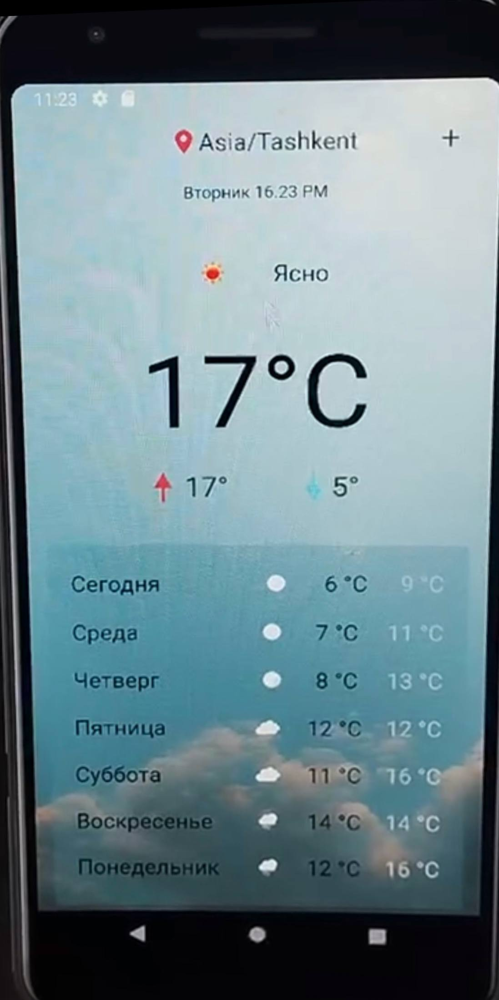
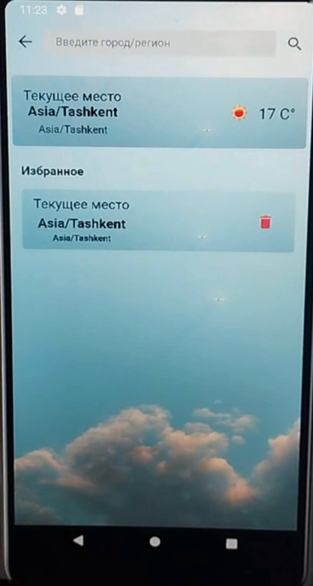

# ⛅ Weather Application (Student Practical Project)

A Flutter mobile application that displays current weather conditions, a multi-day forecast, and location-based weather metrics in a clean, visual interface. 

This repository was created as an **academic/course practical project** to practice cross-platform development, state management, local database integration, and REST API handling. It was originally developed during mobile development training and later modernized to run smoothly with the latest Flutter and Dart SDKs.

---

## 🎯 Learning Objectives & Key Concepts

Through this student project, the following core software engineering concepts were put into practice:
- **Clean Architecture Principles:** Separation of concerns between UI components, state management, and data layers (`domain/` vs `ui/`).
- **State Management:** Utilizing `Provider` for reactive application state updates.
- **Local Data Persistence:** Using `Hive` and `Shared Preferences` for caching user preferences and favorite cities.
- **API Handling & Demo Mode:** Working with JSON parsing, environment configuration, and graceful degradation via local JSON fallback.

---

## 🚀 Overview & Features

The application allows users to search for weather information across different locations, save favorite cities, and view detailed metrics (temperature, humidity, wind speed, visibility, sunrise/sunset).

### Key Features
- Current weather conditions and multi-day forecast
- Temperature ranges (Min / Max) with visual icons
- Wind speed, humidity, and visibility metrics
- Location search with local persistence for favorite cities
- Dynamic weather backgrounds matching current conditions
- **Demo Mode** with bundled local JSON data (for instant offline testing)
- Optional live OpenWeather API integration via `.env` configuration

---

## 🛠️ Technologies Used

- **Framework & Language:** Flutter, Dart
- **State Management:** Provider
- **Local Storage:** Hive, Shared Preferences
- **Utilities & Design:** `flutter_svg`, `flutter_dotenv`, custom UI theme
- **Networking & Data:** REST API integration, JSON serialization/parsing

---

## 📂 Project Structure

```text
lib/
├── domain/            # Business logic and data handling
│   ├── api/           # API interaction & network logic
│   ├── hive/          # Local database storage
│   ├── json_convertors/ # Model classes for JSON parsing
│   └── provider/      # Application state management
│
└── ui/                # User Interface layer
    ├── components/    # Reusable UI widgets
    ├── constants/     # App-wide constants
    ├── pages/         # Screen layouts
    ├── resources/     # Visual resources & assets
    ├── routes/        # App navigation
    └── ui_theme/      # Colors, typography, and styling

assets/
├── demo/              # Bundled JSON data for offline Demo Mode
├── fonts/             # Custom fonts
├── icons/             # Weather & navigation icons
└── images/            # Backgrounds and graphic assets

## Demo Mode

The application runs in Demo Mode by default.

Demo weather data is stored locally in:

```text
assets/demo/
├── coord.json
└── weather_data.json
```

This makes the project reproducible and allows anyone to explore the application without creating an account with an external weather provider.

When Demo Mode is enabled, the application uses the bundled JSON data instead of making external API requests.

## Live Weather Integration

The original application used OpenWeather for live weather information.

The project still contains support for live API requests. An OpenWeather API key can be stored in a local `.env` file:

```env
API_KEY=YOUR_API_KEY
```

The real `.env` file is excluded from Git for security reasons.

A template is provided:

```text
.env.example
```

To create the local environment file:

```bash
cp .env.example .env
```

> Note: the original project used OpenWeather One Call API 2.5. That API version was later discontinued. Demo Mode is therefore enabled by default so the project remains fully viewable without relying on the legacy external service.

## Getting Started

### 1. Clone the repository

```bash
git clone https://github.com/YOUR_USERNAME/weather-application.git
cd weather-application
```

### 2. Install dependencies

```bash
flutter pub get
```

### 3. Create the environment file

```bash
cp .env.example .env
```

For Demo Mode, the API key can remain empty.

### 4. Run the application

```bash
flutter run
```

For macOS:

```bash
flutter run -d macos
```

## Screenshots

### Home Screen



### Search Screen



## Development History

This application was originally developed several years ago using an older Flutter/Dart environment.

The project was later restored and modernized to work with current Flutter and Dart versions. The restoration included:

- updating Flutter dependencies;
- migrating the project to a modern Dart SDK;
- restoring package imports;
- updating deprecated Flutter code;
- restoring macOS build support;
- updating platform permissions;
- securing API credentials using environment variables;
- replacing the discontinued weather API dependency with a demo-data fallback;
- improving compatibility with modern Flutter layouts.

The original architecture and application logic were preserved wherever possible.

## Security

API credentials are never committed to the repository.

The following file is excluded through `.gitignore`:

```text
.env
```

Only `.env.example`, which contains no real credentials, is included in the repository.

## Future Improvements

Possible future improvements include:

- integration with a new live weather API;
- automatic location detection;
- additional localization support;
- improved responsive layouts for desktop and mobile;
- unit and widget tests;
- improved error handling and offline support.

## Author

Nigina Suvanova

Software Engineering Student at IT Park University (ITPU)

GitHub: @stajl7

Primary Project Context: Mobile Application Development Practical Assignment (ProWeb / ITPU)
